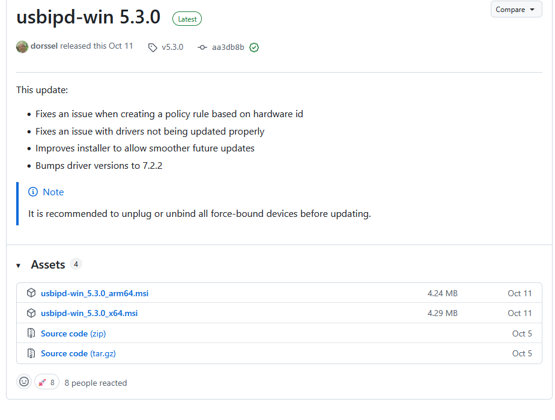
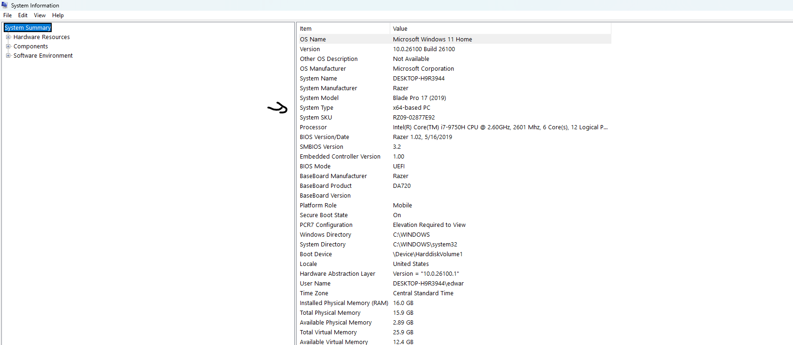
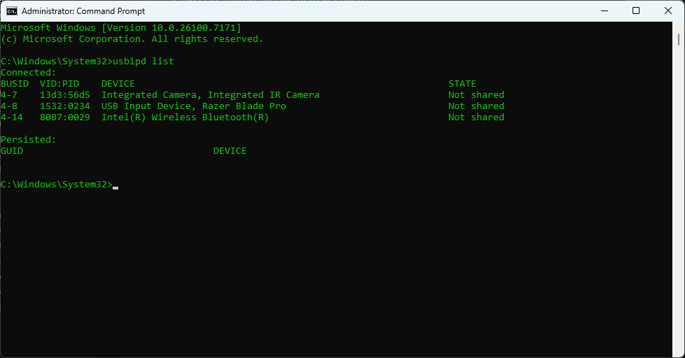
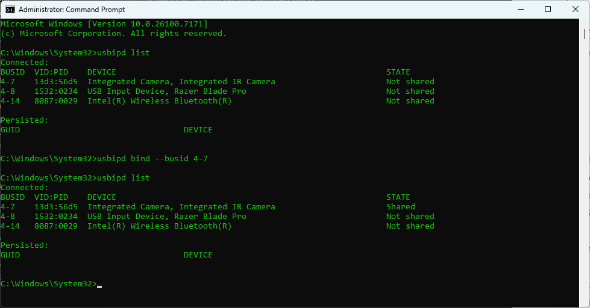
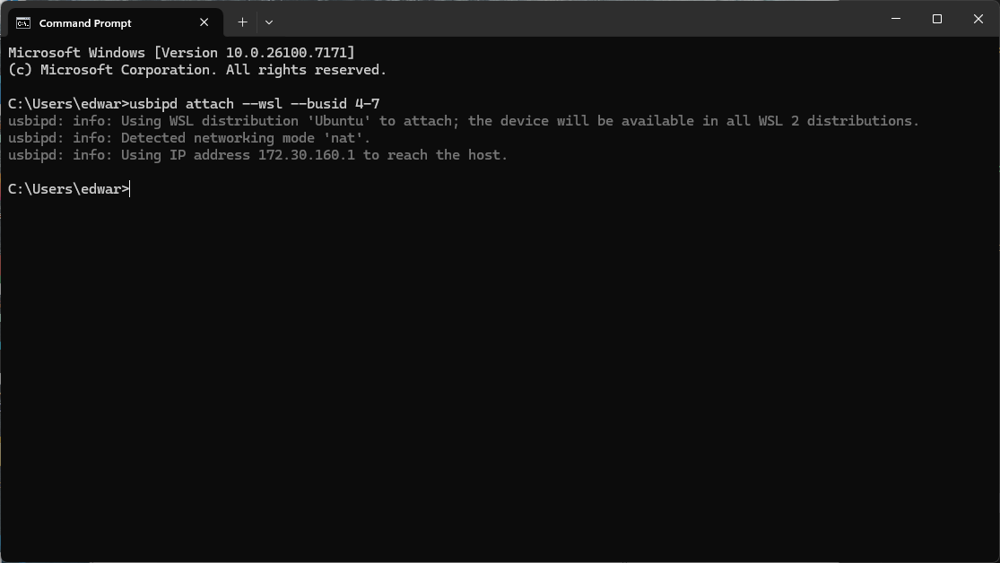
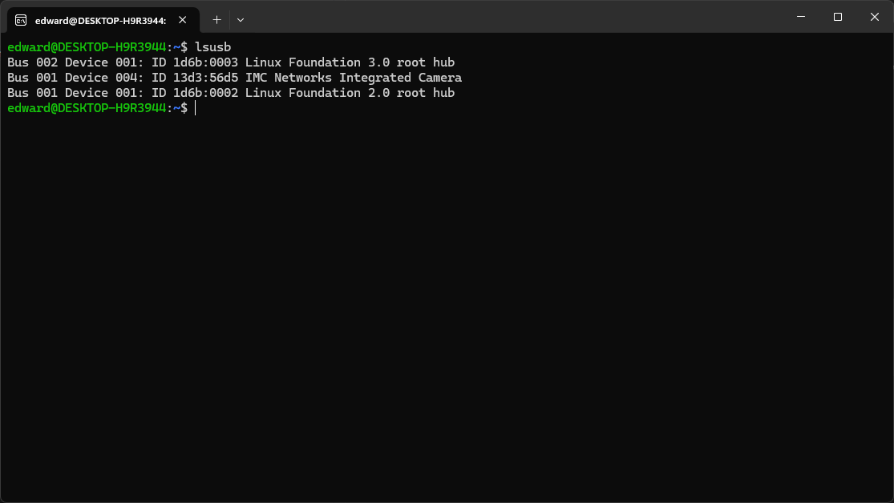

# Current Installation instructions:
### Note: 
I can not attest that these instructions will work for everyone as I probably forgot a step or two somewhere. Though just send a message and I will probably remember what I missed once I see the problem.
### Setting up the camara for those using wsl (Itzi you don't need to do this):
On the windows side you are going to want to use [usbipd-win](https://github.com/dorssel/usbipd-win/releases/tag/v5.3.0). 
1. Download the .msi version as it is easy then building from source.

I think that we all x64 arch., but if you want to make sure press <kbd>⊞ Win</kbd> + <kbd>r</kbd>,type `msinfo`, and click okay. You should see this.
 
 System Type is what you should pay attention to.

2. Run the program 

3. Once it is done installing open command prompt as administrator.

4. If usbipd installed correctly, you should be able to run 
    ```powershell
    usbipd list 
    ````
    This is what appears when I run it.
    
    These are the devices you currently have connected to your computer. Your camara should be appearing here.

5. We are going to be sharing the device by using the ```bind``` command. The bus id is of the camara is what you need to do it. My is 4-7; yours will most likely be different. Replace the ```busid``` with your own.
    ```powershell 
    usbipd bind --busid <busid>
    ````
    Once done you should be able to run again
     ```powershell
    usbipd list 
    ```
    and see that the camara is now in the sharing state.
    
    You can now close this window.
6. Open a new command prompt window, but this time do not do it in administrator mode. We are going to be attaching the camara to wsl now. Run the following command with the same ```busid``` you used last time.
      ```powershell
    usbipd attach --wsl --busid <busid>
    ```
    You should see something like this.
    
    And we are done with this. You can confirm that it worked by running in wsl
    ```bash
    lsusb
    ```
    and seeing something like this 
    
### Setting up the enviroment:
Here comes the diffcult part 
1. Create a folder that you are going to be storing everything in. In my case I called final_ros_ws. 
[!NOTE]
This is not the actual ros workspace. I am just too lazy to change it.
2. Wait I want to try something